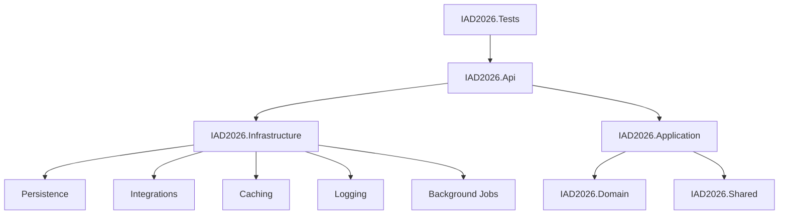
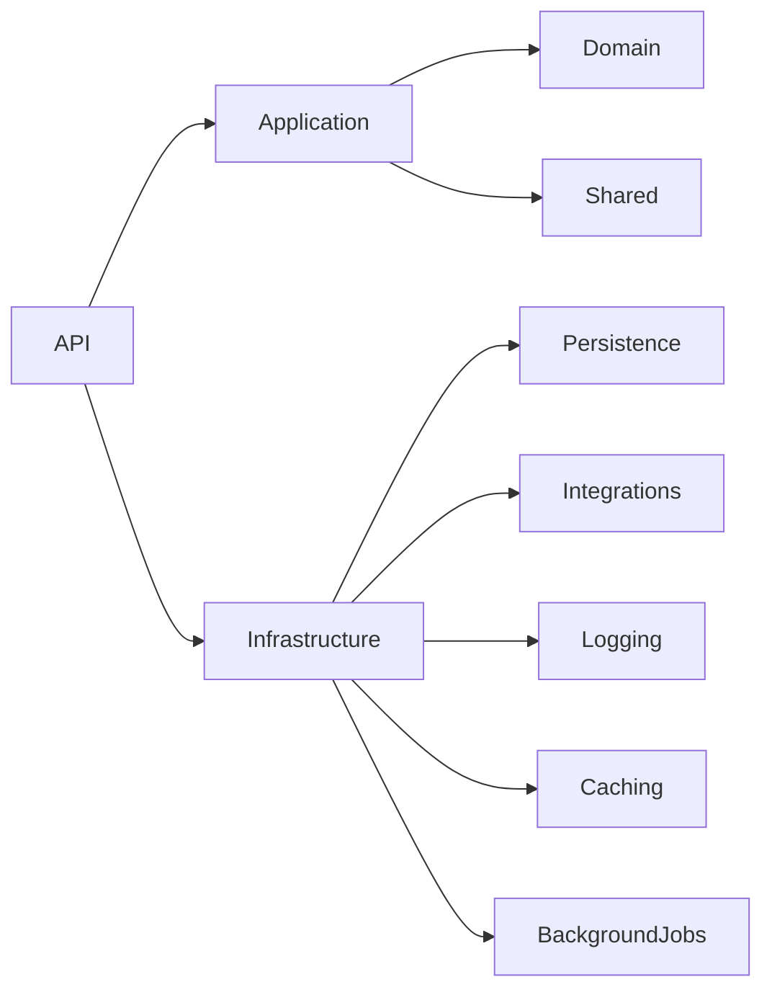

# IAD2026 – Enterprise API Management Template

A production-ready **.NET 10 Clean Architecture** template designed for enterprise systems that integrate with multiple external APIs, databases, background jobs, caching, and logging.

---

## Features

- Clean Architecture
- Modular design
- Multiple external API integrations
- Multiple database support
- Background job processing
- Structured logging
- Distributed caching ready
- MediatR + FluentValidation
- Repository pattern
- Enterprise-ready project structure

---

# Architecture



---

# Solution Structure

```text
IAD2026.Api
IAD2026.Application
IAD2026.Domain
IAD2026.Shared

IAD2026.Infrastructure
│
├── Persistence
├── Integrations
├── Caching
├── Logging
└── BackgroundJobs

IAD2026.Tests
```

---

# Layer Responsibilities

## Domain

Contains:

- Entities
- Value Objects
- Domain Events
- Domain Exceptions
- Business Rules

Dependencies:

None

---

## Shared

Contains reusable components shared across the solution.

Examples:

- Result<T>
- Error
- ApiResponse
- Pagination
- Common DTOs
- Constants
- Extensions

Dependencies:

None

---

## Application

Contains all business use cases.

Responsibilities:

- CQRS (MediatR)
- Commands
- Queries
- DTOs
- Validation
- Interfaces
- Business orchestration

Depends on:

- Domain
- Shared

---

## Infrastructure

Contains implementations for abstractions defined in Application.

Modules include:

### Persistence

- Entity Framework Core
- DbContexts
- Repository implementations
- Migrations

Supports:

- SQL Server
- PostgreSQL
- InMemory

---

### Integrations

External services including:

- OAuth2 APIs
- API Key APIs
- Session Authentication APIs

Examples:

- SharePoint
- SAP
- CRM
- Billing Systems

Includes:

- Typed HttpClients
- Polly resilience
- Token providers
- Credential providers

---

### Caching

Supports:

- Memory Cache
- Redis (future)

Used for:

- Tokens
- Frequently accessed data
- External API responses

---

### Logging

Structured logging using:

- Serilog
- Console
- File

Future:

- Seq
- Elastic
- OpenTelemetry

---

### Background Jobs

Uses Hangfire for:

- Scheduled jobs
- Retry jobs
- Synchronization
- Cleanup jobs

---

## API

Responsibilities:

- REST Endpoints
- Carter Modules
- Swagger
- Middleware
- Authentication
- Dependency Injection

Contains:

- Health endpoints
- External API endpoints
- Task endpoints

---

## Tests

Contains:

- Unit Tests
- Integration Tests

---

# Dependency Flow



---

# External API Strategy

Each external system is isolated behind:

- Typed HttpClient
- Credential Provider
- Authentication Strategy
- Resilience Policies
- Logging
- Caching

Benefits:

- Reusable
- Testable
- Maintainable
- Easy to replace

---

# Database Strategy

Supports multiple databases.

Examples:

- SQL Server
- PostgreSQL
- SQLite (testing)
- InMemory

Each bounded context may own its own DbContext.

---

# Background Processing

Hangfire is used for:

- Data synchronization
- Token refresh
- Scheduled imports
- Cleanup
- Retry processing

---

# Logging

Uses Serilog with structured logging.

Supports:

- Correlation IDs
- Request logging
- Exception logging
- Performance logging

---

# Caching

Current:

- Memory Cache

Future:

- Redis
- Distributed Cache

---

# Technology Stack

| Technology | Purpose |
|------------|---------|
| .NET 8 | Runtime |
| ASP.NET Core | Web API |
| Carter | Minimal API modules |
| MediatR | CQRS |
| FluentValidation | Validation |
| Entity Framework Core | ORM |
| Serilog | Logging |
| Hangfire | Background Jobs |
| Polly | Resilience |
| StackExchange.Redis | Distributed Cache |
| Mapster | Object Mapping |

---

# Design Principles

- Clean Architecture
- Dependency Inversion
- Separation of Concerns
- SOLID
- Modular Design
- Plugin-based Integrations
- Testability
- High Maintainability

---

# Current Status

✅ Solution structure created

✅ Architecture defined

✅ Dependency injection strategy

✅ Module separation

🚧 External API framework

🚧 Persistence implementation

🚧 Authentication

🚧 Background jobs

🚧 Caching

---

# Future Roadmap

- OAuth2 Provider Framework
- Dynamic Plugin System
- OpenTelemetry
- Distributed Caching
- Multi-database Transactions
- API Gateway Support
- Event Bus
- Docker Compose
- Kubernetes Deployment
- CI/CD Pipeline

---

# License

Internal Enterprise Template
