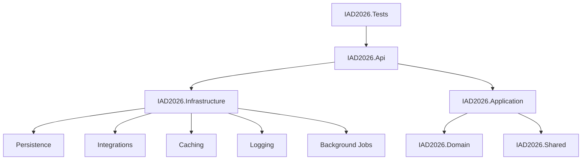
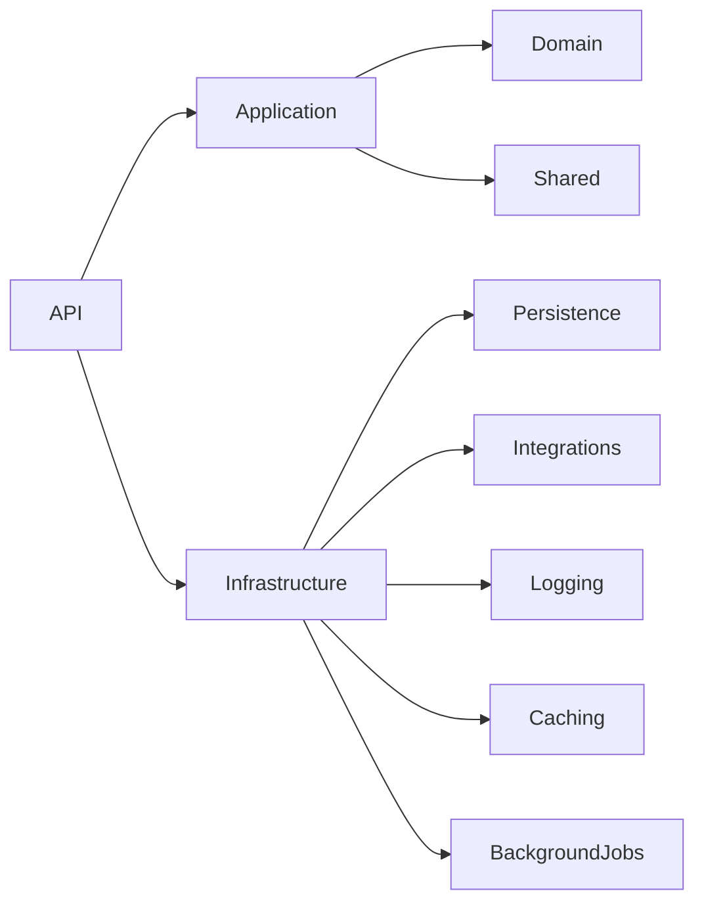

# IAD2026 – Enterprise API Management Template

A production-ready **.NET 10 Clean Architecture** template designed for enterprise systems that integrate with multiple external APIs, databases, background jobs, caching, and logging.

---

## Features

- Clean Architecture
- Modular design
- Multiple external API integrations
- Multiple database support
- **Extensible Background Job Processing (Hangfire)**
- **Transactional Outbox Pattern**
- **Strategy Pattern Task Executors**
- Structured logging (Serilog with Framework noise reduction)
- Distributed caching ready
- MediatR + FluentValidation
- Repository pattern
- Enterprise-ready project structure

---

# Architecture



---

# Solution Structure

```text
IAD2026.Api
IAD2026.Application
IAD2026.Domain
IAD2026.Shared

IAD2026.Infrastructure
│
├── Persistence
├── Integrations
├── Caching
├── Logging
└── BackgroundJobs

IAD2026.Tests

```

---

# Layer Responsibilities

## Domain

Contains:

* Entities (e.g., `OutboxTask`)
* Value Objects
* Domain Events
* Domain Exceptions
* Business Rules

Dependencies:

None

---

## Shared

Contains reusable components shared across the solution.

Examples:

* Result
* Error
* ApiResponse
* Pagination
* Common DTOs
* Constants
* Extensions

Dependencies:

None

---

## Application

Contains all business use cases.

Responsibilities:

* CQRS (MediatR)
* Commands
* Queries
* DTOs
* Validation
* Interfaces (e.g., `ITaskExecutor`, `IOutboxRepository`)
* Business orchestration

Depends on:

* Domain
* Shared

---

## Infrastructure

Contains implementations for abstractions defined in Application.

Modules include:

### Persistence

* Entity Framework Core
* DbContexts (e.g., `AppDbContext`)
* Repository implementations (e.g., `OutboxRepository`)
* Migrations
* Optimized Table Indexes (e.g., O(1) Outbox lookups)

Supports:

* SQL Server
* PostgreSQL
* InMemory

---

### Integrations

External services including:

* OAuth2 APIs
* API Key APIs
* Session Authentication APIs

Examples:

* SharePoint
* SAP
* CRM
* Billing Systems
* Telecom SMS Gateways

Includes:

* Typed HttpClients
* Polly resilience (Circuit Breakers, Retries)
* Token providers
* Credential providers

---

### Caching

Supports:

* Memory Cache
* Redis (future)

Used for:

* Tokens
* Frequently accessed data
* External API responses

---

### Logging

Structured logging using:

* Serilog (with Microsoft/System namespace noise reduction)
* Console
* File

Future:

* Seq
* ElasticSearch
* OpenTelemetry

---

### Background Jobs

Uses **Hangfire** powered by the **Transactional Outbox Pattern** and **Strategy Pattern** for:

* Scheduled jobs (e.g., Nightly Log Scrubbing)
* High-throughput asynchronous event processing (e.g., Bulk SMS Dispatch)
* At-least-once guaranteed execution
* Automatic error retries and exponential backoff
* Clean execution routing via `ITaskExecutor`

---

## API

Responsibilities:

* REST Endpoints
* Carter Modules
* Swagger
* Middleware
* Authentication
* Dependency Injection (Composition Root)

Contains:

* Health endpoints
* External API endpoints
* Task endpoints
* Hangfire Dashboard (`/hangfire`)

---

## Tests

Contains:

* Unit Tests
* Integration Tests

---

# Dependency Flow



---

# External API Strategy

Each external system is isolated behind:

* Typed HttpClient
* Credential Provider
* Authentication Strategy
* Resilience Policies (Polly)
* Logging
* Caching

Benefits:

* Reusable
* Testable
* Maintainable
* Easy to replace

---

# Database Strategy

Supports multiple databases.

Examples:

* SQL Server
* PostgreSQL
* SQLite (testing)
* InMemory (Template default)

Each bounded context may own its own DbContext.

---

# Technology Stack

| Technology | Purpose |
| --- | --- |
| .NET 10 | Runtime |
| ASP.NET Core | Web API |
| Carter | Minimal API modules |
| MediatR | CQRS |
| FluentValidation | Validation |
| Entity Framework Core | ORM |
| Serilog | Logging |
| Hangfire | Background Jobs & Outbox Engine |
| Polly | Resilience |
| StackExchange.Redis | Distributed Cache |
| Mapster | Object Mapping |

---

# Design Principles

* Clean Architecture
* Dependency Inversion
* Separation of Concerns
* SOLID
* Modular Design
* Plugin-based Integrations (Strategy Pattern)
* Testability
* High Maintainability
* Idempotency

---

# Current Status

✅ Solution structure created

✅ Architecture defined

✅ Dependency injection strategy

✅ Module separation

✅ External API framework

✅ Persistence implementation

✅ Background jobs (Hangfire + Outbox Pattern)

✅ Strategy Pattern Task Executors

🚧 Authentication

🚧 Caching

---

# Future Roadmap

* Centralized Log Aggregation (Seq/Elastic)
* Redis Backed Hangfire Storage & Distributed Caching
* Advanced MediatR Command/Query Segregation (CQRS)
* OAuth2 Provider Framework
* Dynamic Plugin System
* OpenTelemetry
* Multi-database Transactions
* API Gateway Support
* Event Bus Integration (RabbitMQ/Kafka)
* Docker Compose
* Kubernetes Deployment
* CI/CD Pipeline

---

# License

Internal Enterprise Template

```

```
